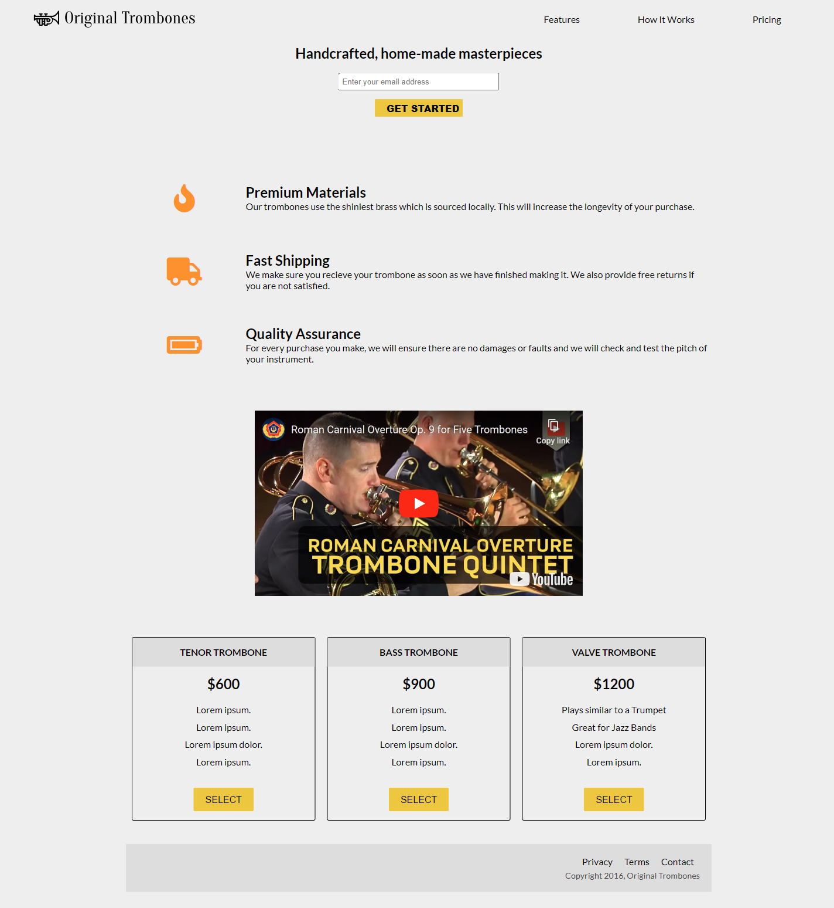
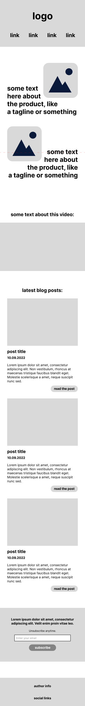

# freeCodeCamp-product-landing-page

This is my take on the "Build a Product Landing Page" project from [freeCodeCamp](http://freecodecamp.org)'s [Responsive Web Design](https://www.freecodecamp.org/learn/2022/responsive-web-design/) course.

## Objective

Build an app that is functionally similar to [https://product-landing-page.freecodecamp.rocks].

**Example screenshot:**  

  

## Requirements

1. Your product landing page should have a `header` element with a corresponding `id="header"`.
2. You can see an image within the `header` element with a corresponding `id="header-img"` (A logo would make a good image here).
3. Within the `#header` element, you can see a `nav` element with a corresponding `id="nav-bar"`.
4. You can see at least three clickable elements inside the `nav` element, each with the class `nav-link`.
5. When you click a `.nav-link` button in the `nav` element, you are taken to the corresponding section of the landing page.
6. You can watch an embedded product video with `id="video"`.
7. Your landing page has a `form` element with a corresponding `id="form"`.
8. Within the form, there is an `input` field with `id="email"` where you can enter an email address.
9. The `#email` input field should have placeholder text to let users know what the field is for.
10. The `#email` input field uses HTML5 validation to confirm that the entered text is an email address.
11. Within the `form`, there is a `submit` `input` with a corresponding `id="submit"`.
12. When you click the `#submit` element, the email is submitted to a static page (use this mock URL: [https://www.freecodecamp.com/email-submit]).
13. The navbar should always be at the top of the viewport.
14. Your product landing page should have at least one media query.
15. Your product landing page should utilize CSS flexbox at least once.

## My solution

### Screenshots

| Lazy mobile wireframe (Figma) | Mobile solution | Desktop solution |
| ------------- | ------------- | ------------- |
|   |  | 

### Links

[Solution on CodePen](https://codepen.io/amparoamparo/)

## My process

### Built with

* Mobile-first workflow
* Figma for wireframing
* Semantic HTML5 markup
* CSS custom properties
* CSS Grid
* Flexbox

### What I learned

Use this section to recap over some of your major learnings while working through this project. Writing these out and providing code samples of areas you want to highlight is a great way to reinforce your own knowledge.

To see how you can add code snippets, see below:

```html
<h1>Some HTML code I'm proud of</h1>
```

```css
.proud-of-this-css {
  color: papayawhip;
}
```

```js
const proudOfThisFunc = () => {
  console.log('🎉')
}
```

If you want more help with writing markdown, we'd recommend checking out [The Markdown Guide](https://www.markdownguide.org/) to learn more.

### Continued development

Use this section to outline areas that you want to continue focusing on in future projects. These could be concepts you're still not completely comfortable with or techniques you found useful that you want to refine and perfect.

### Useful resources

* [Example resource 1](https://www.example.com) - This helped me for XYZ reason. I really liked this pattern and will use it going forward.
* [Example resource 2](https://www.example.com) - This is an amazing article which helped me finally understand XYZ. I'd recommend it to anyone still learning this concept.

### Author

* Amparo Zeballos [amparozeballos@gmail.com](mailto:amparozeballos@gmail.com)
* freeCodeCamp - [@amparo](https://www.freecodecamp.org/amparo)
* GitHub - [@amparoamparo](https://github.com/amparoamparo)
* CodePen - [@amparoamparo](https://codepen.io/amparoamparo)
* Twitter - [@frontendamparo](https://twitter.com/frontendamparo)
